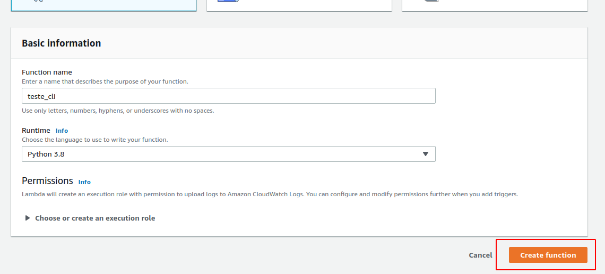

- [Serverless](#Serverless)
- [CLI](#CLI)

# Objetivo
Mostrar duas formas de criar funções lambda, e fazer deploy automático para a aws via github actions. Sendo que a primeira que mostrarei será via o framwork serverless, e a segunda utiliza a cli da aws. Já adianto que o segundo método além de mais simples, é muito mais rápido. O método com serverless demora em torno de 50 segundos a 1:30 min para executar, já com a cli demora em torno de 5 a 16 segundos.

# Serverless
---

## Instalar
- [node](https://nodejs.org/en/)
- [serverless framwork](https://www.serverless.com/framework/docs/getting-started/)
    ```shell
    $ npm install -g serverless
    $ npm update -g serversless
    ```

> OBS.: não é necessário instalar pelo node, mas a vantagem disso é que fica o mesmo comando para todos os sistemas operacionais, mas caso queira utilizar o gerenciador de pacotes do seu sistema, fique a vontade. Mas no windows ele utiliza o [chocolatey](https://chocolatey.org/) para fazer a instalação, então é necessário instalá-lo também.

Para confirmar a instalação rode o comando
```shell
$ serverless --version
```

Se retornar alguma versão então está tudo ok.

Para te auxiliar, tenha sempre a documentação aberta. Lá eles ensinam como configurar tudo para os serviços de serverless. Vá para [user guide](https://www.serverless.com/framework/docs/providers/aws/guide/) que vai te ajudar muito.

## Criando usuário
Agora vá até a aws e crie um novo usuário IAM

- entre na sua conta e pesquise por IAM no painel de controle da aws
- Chegando no painel, escolha na barra leteral a opção `Users`
- Click no botão `Add user`


- De um nome para esse usuário e o de acesso programático


- Nas permissões escolha `Attach existing policies directly` e escolha a opção `AdministratorAccess`


> OBS.: se for o caso, você pode escolher politicas de acesso diferentes para seus usuários, eu peguei essa, mas ela da acesso a tudo, então vai de cada caso, mas garanta que terá acesso a tudo que for necessário.

- nas próximas duas telas, apenas de next.

- na última tela a aws vai te mostrar a `Access key ID` e a `Secret access key`. Guarde essas duas informações pois serão necessárias posteriormente.


> OBS.: se não salvar essas informações ou esquecer depois, entre no seu usuário e vá em `Security crdentials` e em `Create access key`.


## Criando template com serverless
[Documentação](https://www.serverless.com/framework/docs/providers/aws/cli-reference/create/)

Como o serverless consegue criar funções lambda em qualquer serviço, seja ele aws, google, azure, ele precisa criar um template de acordo com esse serviço, para que o serviço em si entenda como deve fazer a criação do mesmo. Para isso rode o comando:

```shell
$ serverless create --template <provider-language> --path <service-name>
```

- provider: aws, azure, google...
- language: nodejs, python3, kotlin, go...
- service-name: nome da sua função lambda

Para ver todos os templates possíveis, rode o comando 
```shell
$ serverless create --help
```

Para seguir com o exemplo eu vou escolher o template de aws-python3 e darei o nome de `python-serverless`

```shell
$ serverless create --template aws-python3 --path python-serverless
```

Veja que ele cria uma pasta com o nome `python-serverless`, e dentro dela temos os arquivos:
- handler.py: que é a função serverless
- serverless.yml: que contém as configurações para tudo funcionar corretamente

> ⚠️ A partir de agora redirecione o seu teminal para dentro dessa pasta.

uma parte importante do arquivo yml é
```yml
functions:
  hello:
    handler: handler.hello
```

Que indica o nome da função e o arquivo dela. se você notar o seu arquivo handler.py, você vai ver que o nome dele é handler, por isso o handler.hello, e o nome da função dentro dele é hello. para ficar melhor de entender, imagine que o arquivo handler fosse renomeado para `test` e a função dentro dele se chamasse `myFunction`, então teriamos

```yml
functions:
  myFunction:
    handler: test.myFunction
```

## Configurando as credênciais
[Documentação](https://www.serverless.com/framework/docs/providers/aws/cli-reference/config-credentials/)

Agora precisamos configurar as credênciais para que o framework consiga subir a aplicação para a aws, para isso vamos precisar das credênciais daquele usuário que criamos anteriormente. Para fazer isso é bem simples. digite no teminal:

```shell
$ serverless config credentials --provider <provider> --key <Access key ID> --secret <Secret access key>
```

Exemplo:

```shell
$ serverless config credentials --provider aws --key 1234 --secret 5678
```

> OBS.: Caso já tenha feito isso alguma fez antes, coloque `-o` na frente de `credentials` para o serverless sobreescrever as informações que ele tinha antes.

>    ```shell
>    $ serverless config credentials -o --provider <provider> --key <Access key ID> --secret <Secret access key>
>    ```

## Fazendo o deploy
[Documentação](https://www.serverless.com/framework/docs/providers/aws/cli-reference/deploy/)

Basta digitar no terminal o comando 
```shell
$ serverless deploy
```

se quiser ver as informações de deploy durante o período de execução da ação digite
```shell
$ serverless deploy -v
```

Se você der o comando com o -v você notara que ele criou a função lambda, mas também criou um bucket no S3, isso porque a função lambda fica salva no S3 como um arquivo zip.

Se você entrar na sua conta da aws, e for procurar a função lambda, você verá a sua função não aparece, isso porque ela foi criada na região default, que é N. Virginia. Mas isso é passível de configuração, para mudar para São Paulo, basta fazer o seguinte no arquivo `serverless.yml`:

```yml
provider:
  region: sa-east-1
```




## Como disparar essa função
[Documentação](https://www.serverless.com/framework/docs/providers/aws/events/)

Você pode configurar isso pelo proprio painel da aws, mas pode também fazer isso com a ajuda do serveless. Eu vou seguir com o serverless.

Temos agora dois jeitos de invocar uma função lambda, com uma request http, ou então com um evento. Com evento eu quero dizer "alguma modificação dentro dos servições da aws", por exemplo, sempre que aparecer um arquivo novo em um dado bucket a função lambda executará.

Para o nosso caso, vamos colocar o evento como sendo uma chamada a uma api, nesse caso a [http api](https://www.serverless.com/framework/docs/providers/aws/events/http-api/) que é um serviço da aws (na aws será criada uma Api Getway).

Para configurar isso através do serverless, basta modificar o arquivo `serverless.yml` deixando-o da seguinte forma:

```yml
functions:
  hello:
    handler: handler.hello
    events:
      - httpApi: 
          method: GET 
          path: /
```

Ou seja, eu defini que quando chamarmos o endereço http da nossa api na rota `/` via verbo GET nós iremos executar a função hello.

Se quisermos definir que nossa api terá várias rotas, e que cada uma executará uma função diferente para nós, basta criar essas funções dentro da função lambda, por exemplo

```Python
import json

def hello(event, context):
    body = {
        "message": "Go Serverless v1.0! Your function executed successfully!",
        "input": event
    }

    response = {
        "statusCode": 200,
        "body": json.dumps(body)
    }

    return response

def helloWorld(event, context):
    body = {
        "message": "hello world",
        "input": event
    }

    response = {
        "statusCode": 200,
        "body": json.dumps(body)
    }

    return response
```

> OBS.: Esse código está dentro do arquivo `handler.py`.

```yml
functions:
  hello:
    handler: handler.hello
    events:
      - httpApi:
          method: GET
          path: /
  helloWorld:
    handler: handler.helloWorld
    events:
      - httpApi:
          method: GET
          path: /world
```

> OBS.: Se quiser passar parâmetros pela rota, basta configurar o path dessa rota da seguinte forma: `path: /get/any/{param}`.

### Cors
Agora precisamos habilitar o cors para que as requestes possam ser feitas a partir do navegador. Para isso configure o arquivo `.yml`

```yml
provider:
  httpApi:
    cors: true
```

Só que ao fazer isso o cors está habilitado para qualquer origem. Ou seja, se você deseja que seja possível apenas para sua aplicação chamar essa função lambda, isso ai não pode ser feito. Pois desse jeito, qualquer um que tenha o link da aplicação pode chamá-la. Se esse for o objetivo então está tudo certo. Mas se não escreva:

```yml
provider:
  httpApi:
    cors:
      allowedOrigins:
        - https://url1.com
        - https://url2.com
```

Assim você permite que apenas essas duas urls chamem sua api (executem a função). Sendo assim você pode passar a url do seu backend ou frontend e quando ele fizer uma request a essa função ela irá permitir a execução.

Também é possível de forma bem simples, configurar jwt, verbos http permitidos, quais os tipos de headers podem ser passados. Veja a [documentação](https://www.serverless.com/framework/docs/providers/aws/events/http-api#cors-setup) para melhor se informar de como fazer isso.


No final das contas meu arquivo `serverless.yml` está da seguinte forma:

```yml
service: python-serverless

provider:
  name: aws
  runtime: python3.8
  region: sa-east-1
  httpApi:
    cors: true

functions:
  hello:
    handler: handler.hello
    events:
      - httpApi:
          method: GET
          path: /
  helloWorld:
    handler: handler.helloWorld
    events:
      - httpApi:
          method: GET
          path: /world
```

Depois de tudo isso, basta executar:
```shell
$ serverless deploy
```

Que todas as modificações serão mandadas para a aws. Se rodar o comando com -v poderá ver que dentre os logs ele te retorna os endpoits das funções


E se for para dentro da função lá no painel da aws, você verá que temos um trigger para essa função


E se jogarmos essas urls no navegador termos:


> OBS.: Se você for nas suas funções lambda agora, verá que tem duas funções lá, isso acontece porque temos duas funções dentro desse código. Então pode ser que seja melhor criar uma função para cada coisa, porque vai ser sepado de qualquer jeito. Mas aqui foi um exemplo, então foi assim mesmo.

> OBS.: Como utilizei apenas métodos get o cors não faz muita diferença, mas se fosse post ou qualquer outro verbo http, ai sim faria diferença.

## Continuous Deploy

### Configurando a organização dos arquivos
Primeiro de tudo, precisamos que todos os arquivos que estavam nessa pasta (`python-serverless`) passem para a pasta principal do repositório.

- Antes:
  ```shell
  ├── python-serverless
  │   ├── handler.py
  │   ├── .gitignore
  │   └── serverless.yml
  └── README.md
  ```

- Depois:
  ```shell
  ├── handler.py
  ├── README.md
  ├── .gitignore
  └── serverless.yml
  ```

### Configurando o repositório no github
- Vá até o repositório no github
- Abra as `Settings` do repositório


- Vá em `Secrets` e depois em `New secret`, para criar uma chave, veja no na imagem que criei duas chaves, que são as chaves necessárias para o serverless ter acesso a aws.


> OBS.: Como já diz na propria página do github, essas variáveis ambiente não são mostradas para ninguém, nem mesmo para um fork da aplicação.

- Agora vá em `Actions` e `set up a workflow yourself`


- na tela que se abre, você pode clicar em `Documentation` para aprender um pouco melhor como funciona para configurar esse arquivo. Mas para nossas finalidades basta copiar isso aqui:

```yml
name: CD
on:
  push:
    branches: [ master ]

jobs:
  build:
    runs-on: ubuntu-latest
    steps:
    - uses: actions/checkout@v2
      
    - name: Setup Node
      uses: actions/setup-node@v1
      with:
        node-version: '12.x'

    - name: Install serverless
      run: npm install -g serverless
    
    - name: Configure serverless
      run: serverless config credentials --provider aws --key ${{ secrets.ACCESS_KEY_ID }} --secret ${{ secrets.SECRETE_ACCESS_KEY }}

    - name: Serverless deploy
      run: serverless deploy
```

> OBS.: Esse código está dentro do arquivo `serverless_main_action.yml`.

Esse arquivo contém as instruções para que o github actions execute. Nele, eu estou mandando utilizar uma máquina ubuntu, com o node, e depois instalar o serverless e configura-lo com nossas variáveis ambiente, e depois fazer o deploy. Sendo que essa ação ocorre sempre que fizermos um push para dentro da master.

Pronto, agora qualquer modificação que fizer dentro da master será automaticamente enviada para a aws. Para ver o processo acontecendo, irei fazer uma modificação aqui no código, mandando a função `hello` mostrar apenas `hello you!!`.


> OBS.: Não deixei o gif concluir pois o processo demora um pouco, então o gif ficaria muito grande.

Depois do processo ser concluído, entre no link da sua função lambda e veja a mudança


### Melhorando o processo
#### Action
[Documentação](https://help.github.com/pt/actions/reference/workflow-syntax-for-github-actions)

Como a action está executando sempre que ocorre uma modificação na master, então até mesmo uma modificação do readme faz com que o processo de deploy ocorra. Mas isso não e uma boa ideia, afinal leva tempo para executar. Então seria melhor que a action executasse somente quando modificarmos o arquivo `handler.py` ou o arquivo `serverless.yml`. Para isso, abra o arquivo da action, e vamos modificá-lo da seguinte forma:

```yml
on:
  push:
    branches: [ master ]
    paths: 
      - '**.py'
      - '**.yml'
```

Assim, toda vez que acontecer um push para a master que esteja modificando arquivos .py ou .yml ele ativa a action, caso contrário ele não ativa.

#### Serverless
[Documentação](https://www.serverless.com/framework/docs/providers/aws/guide/packaging/)

Outro problema, é que está subindo para dentro da função lambda tudo que está nessa pasta. Até mesmo as imgagens, e isso deixa tudo mais lento. para impedir que isso aconteça apenas adicione ao arquivo `serverless.yml` as linha abaixo

```yml
package:
  exclude:
    - img/**
    - README.md
    - LICENSE
    - .github/**
```

# CLI
---

## Criando usuário
Agora vá até a aws e crie um novo usuário IAM

- entre na sua conta e pesquise por IAM no painel de controle da aws
- Chegando no painel, escolha na barra leteral a opção `Users`
- Click no botão `Add user`


- De um nome para esse usuário e o de acesso programático


- Nas permissões escolha `Attach existing policies directly` e escolha a opção `AdministratorAccess`


> OBS.: se for o caso, você pode escolher politicas de acesso diferentes para seus usuários, eu peguei essa, mas ela da acesso a tudo, então vai de cada caso, mas garanta que tera acesso a tudo que for necessário.

- nas próximas duas telas, apenas de next.

- na última tela a aws vai te mostrar a `Access key ID` e a `Secret access key`. Guarde essas duas informações pois serão necessárias posteriormente.


> OBS.: se não salvar essas informações ou esquecer depois, entre no seu usuário e vá em `Security crdentials` e em `Create access key`.


## Criando a função

Aqui vamos criar a função via interface da aws. Para isso:

- Pesquise no console por lambda:

- Clique em `Create function`:


- Escolha um nome e a runtime da sua função, e depois click em `Create function`


- Agora configure o trigger da forma que preferir, e copie o código da sua função lambda para ter um ponto de partida.


> OBS.: Não sei porque, mas a minha lambda foi criada com o código errado no import, `- import json`, depois eu retirei o traço e funcionou normal, então fique atento com a sua.

## Github

Para gerenciar o nosso código, vamos utilizar o github, então 
- crie um repositório para essa função, 
- clone-o para sua máquina,
- adicione um arquivo chamado lambda_funcition.py,
  > OBS.: Caso queira dar outro nome para o arquivo, não tem problema, mas lembre-se de modificar as chamadas a esse arquivo em todos os lugares daqui para frente.
- Copie o código da função lambda para dentro desse arquivo, 
- Faça o push dessa modificação para o seu repositório remoto no github.


### Github actions

Utilizando o github actions, vamos criar uma action que fará o deploy para nós sempre que houver um push para dentro da branch master do nosso repositório.

A action precisará das nossas chaves de usuário, para isso:

- Vá até o repositório no github
- Abra as `Settings` do repositório


- Vá em `Secrets` e depois em `New secret`, para criar uma chave, veja na imagem que criei duas chaves, que são as chaves necessárias para a cli ter acesso a aws. Uma coisa importante é que nesse caso os nomes precisam ser exatamente esses.


> OBS.: Como já diz na propria página do github, essas variáveis ambiente não são mostradas para ninguém, nem mesmo para um fork da aplicação.

Agora vamos criar a action, mas como no exemplo do serverless eu criei a action pelo github, agora vou criar ela pelo repositório local da minha máquina e depois fazer o push para o remoto.

Para fazer isso: 

- Crie dentro do repositório local a seguinte estrutura de pastas:
  ```shell
  .
  ├── .github
  │   └── workflows
  │       └── main.yml
  └── lambda_function.py
  ```

- Escreva dentro do arquivo `main.yml`:

```yml
name: CD

on:
  push:
    branches: [ master ]

jobs:
  deploy:
    name: Upload to Amazon Lambda
    runs-on: ubuntu-latest

    steps:
    - name: Checkout
      uses: actions/checkout@v2
    
    - name: zip file
      run: zip lambda_function lambda_function.py

    - name: Configure AWS credentials from Test account
      uses: aws-actions/configure-aws-credentials@v1
      with:
        aws-access-key-id: ${{ secrets.AWS_ACCESS_KEY_ID }}
        aws-secret-access-key: ${{ secrets.AWS_SECRET_ACCESS_KEY }}
        aws-region: us-east-1

    - name: update lambda
      run: aws lambda update-function-code --function-name teste_cli --zip-file fileb://lambda_function.zip
```

> OBS.: Esse código está dentro do arquivo `cli_main_action.yml`.


#### Explicando a action

Nessa parte eu simplesmente dei um nome para minha action, e falei que ela deve ser executada quando houver um push para dentro da master. E inicializei as jobs, com o nome de `Upload to Amazon Lambda`, sendo que elas vão executar em uma máquina ubuntu na última versão

```yml
name: CD

on:
  push:
    branches: [ master ]

jobs:
  deploy:
    name: Upload to Amazon Lambda
    runs-on: ubuntu-latest
```

---

Inicializo os passos dando um checkout, o que é necessário para todas as actions, pois assim a action passa a ver os arquivos do repositório em questão.

```yml
    steps:
    - name: Checkout
      uses: actions/checkout@v2
```

---

Aqui eu faço um zip do arquivo da função lambda e chamo ele de `lambda_function.zip`. Esse processo é necessário, pois enviaremos para a aws o zip.

```yml
    - name: zip file
      run: zip lambda_function lambda_function.py
```

---

Esse processo é o mais importante de todos, com ele nós nos conectamos a aws cli por meio de nossas credenciais, Essa action foi criada pela propria aws, e está disponível no [github de actions da aws](https://github.com/aws-actions/configure-aws-credentials). Juntamente com outras actions.

```yml
    - name: Configure AWS credentials from Test account
      uses: aws-actions/configure-aws-credentials@v1
      with:
        aws-access-key-id: ${{ secrets.ACCESS_KEY_ID }}
        aws-secret-access-key: ${{ secrets.SECRET_ACCESS_KEY }}
        aws-region: us-east-1
```

---

E como a action anterior nos conecta a cli da aws, podemos agora executar comandos da cli, que podem ser vistos [aqui](https://docs.aws.amazon.com/cli/latest/index.html). E dentre eles temos comandos para gerenciar a função lambda, e um deles é o de update do código da função. Que tem o seguinte template:

```yml
    - name: update lambda
      run: aws lambda update-function-code --function-name teste_cli --zip-file fileb://lambda_function.zip
```

```shell
$ aws lambda update-function-code --function-name <lambda_name> --zip-file fileb://<code_file_name.zip>
```

## Mostrando que funciona


