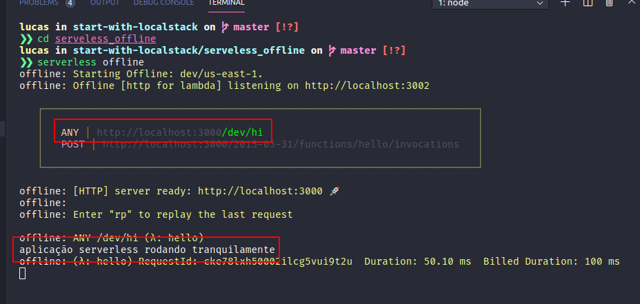

# SUMÁRIO
- [**1. AWS LAMBDA FUNCTIONS**](#1.-AWS-LAMBDA-FUNCTIONS)
- [**2. COMEÇANDO COM LAMBDA**](#2.-COMEÇANDO-COM-LAMBDA)
  - [2.1 CRIANDO USUÁRIO](#2.1-CRIANDO-USUÁRIO)
  - [2.2 CRIANDO A FUNÇÃO](#2.2-CRIANDO-A-FUNÇÃO)
  - [2.3 COMO UTILIZAR](#2.3-COMO-UTILIZAR)
    - [2.3.1 Exemplo](#2.3.1-Exemplo)
  - [2.4 LAYERS](#2.4-LAYERS)
- [**3. SERVERLESS FRAMEWORK**](#3.-SERVERLESS-FRAMEWORK)
  - [3.1 INSTALAR](#3.1-INSTALAR)
  - [3.2 CRIANDO TEMPLATE COM SERVERLESS](#3.2-CRIANDO-TEMPLATE-COM-SERVERLESS)
  - [3.3 CONFIGURANDO AS CREDENCIAIS](#3.3-CONFIGURANDO-AS-CREDENCIAIS)
  - [3.4 FAZENDO O DEPLOY](#3.4-FAZENDO-O-DEPLOY)
  - [3.5 COMO DISPARAR ESSA FUNÇÃO](#3.5-COMO-DISPARAR-ESSA-FUNÇÃO)
    - [3.5.1 Cors](#3.5.1-Cors)
- [**4. TESTE SUAS APLICAÇÕES LOCALMENTE**](#4.-TESTE-SUAS-APLICAÇÕES-LOCALMENTE)
  - [4.1 TESTE DE API](#4.1-TESTE-DE-API)
  - [4.2 LOCALSTACK](#4.2-LOCALSTACK)
- [**5. GITHUB E CONTINUOUS DEPLOY**](#5.-GITHUB-E-CONTINUOUS-DEPLOY)
  - [5.1 GITHUB ACTIONS](#5.1-GITHUB-ACTIONS)
    - [5.1.1 Explicando a action](#5.1.1-Explicando-a-action)

---

# 1. AWS LAMBDA FUNCTIONS

Lambda é o nome das funções serverless da aws. Uma função serverless é um script que executará mediante um evento, sendo ele uma requeste em um dado endpoint ou um evento dentro do ecossistema da aws (como a inserção de um arquivo no s3). Essas funções não precisam de um servidor dedicado, elas simplesmente executam quando chamadas e depois "somem". Uma função serverless também pode ser executada em paralelo a ela mesma, ou seja, caso aconteçam eventos simultâneos cada evento executa sua própria função, isso pode tornar processamentos longos e sequênciais bem rápidos, um exemplo para isso seria o processamento de múltiplos arquivos, que ocorreriam de forma sequêncial em um servidor EC2, mas com as lambdas cada arquivo terá sua própria função executando, fazendo com que todos eles sejam processados ao mesmo tempo. Outra vantagem é o fato de que você paga somente o que usar, e normalmente esse tipo de função é bem barata (se você não fizer besteira, como por exemplo recursividade infinita nas chamadas), evitando pagar por um gasto "fixo" com um EC2 que não seria utilizado em 100% do tempo.

# 2. COMEÇANDO COM LAMBDA
---

Para criar uma função lambda, podemos utilizar diretamente o painel da aws ou então utilizar o auxilio de um framework como o serverless framework. Mas vamos começar a trabalhando pelo próprio painel da aws.

## 2.1 CRIANDO USUÁRIO
---

Agora vá até a aws e crie um novo usuário IAM

- entre na sua conta e pesquise por IAM no painel de controle da aws
- Chegando no painel, escolha na barra lateral a opção `Users`
- Click no botão `Add user`


- De um nome para esse usuário e o de acesso programático


- Nas permissões escolha `Attach existing policies directly` e escolha a opção `AdministratorAccess`


> OBS.: se for o caso, você pode escolher politicas de acesso diferentes para seus usuários, eu peguei essa, mas ela da acesso a tudo, então vai de cada caso, mas garanta que terá acesso a tudo que for necessário.

- nas próximas duas telas, apenas de next.

- na última tela a aws vai te mostrar a `Access key ID` e a `Secret access key`. Guarde essas duas informações pois serão necessárias posteriormente.


> OBS.: se não salvar essas informações ou esquecer depois, entre no seu usuário e vá em `Security crdentials` e em `Create access key`.


## 2.2 CRIANDO A FUNÇÃO
---

Aqui vamos criar a função via interface da aws. Para isso:

- Pesquise no console por lambda:

- Clique em `Create function`:


- Escolha um nome e a runtime da sua função, e depois click em `Create function`


- Agora configure o trigger da forma que preferir, e copie o código da sua função lambda para ter um ponto de partida.


> OBS.: Não sei porque, mas a minha lambda foi criada com o código errado no import, `- import json`, depois eu retirei o traço e funcionou normal, então fique atento com a sua.

Agora que a função está criada você pode editá-la dentro da área `Function code` da aws (mais a frente vou mostrar como fazer isso através da sua máquina e integrar ao github)

## 2.3 COMO UTILIZAR 
---

Primeiramente, quero deixar claro que tudo que chega até a função vem para dentro do parâmetro `event`, em forma de dicionário. Então o melhor jeito de entender onde cada coisa está, é simplesmente retornar o `event` na tela com um simples `print(event)`.

Para isso você pode criar um teste para sua lambda através do console (caso seja um evento interno a aws), mas caso tenha criado o evento como sendo uma API então faça a requeste no endpoint fornecido pela função e veja o retorno.

> OBS.: Nesse caso, coloque o event como sendo o retorno da função:
```Python
    response = {
        "statusCode": 200,
        "body": json.dumps(event)
    }
```

Tendo em mente o retorno do event, você agora irá trabalhar com manipulação de dicionário em python (cada linguarem utilizará uma estrutura de dados, node, por exemplo, utiliza objetos js).

Do mais não tenho muito o que falar, sabendo como visualizar o retorno do event, e tendo em mente que tudo que vem daqui para frente é a linguagem em sí, você pode ir criando suas funções.

### 2.3.1 Exemplo
---

Aqui temos um exemplo simples de uma função, que está sendo ativada por uma api, e que receberá um parâmetro vindo pelo header, chamado `testeheader`, e pelo body virá `email` e `user`, depois juntei tudo isso e retornei em forma de json para o endpoint

```Python
import json

def hello(event, context):
    header = event["multiValueHeaders"]["testeheader"]
    ev_body = json.loads(event["body"])
    email = ev_body["email"]
    user = ev_body["user"]
    body = {
        "message": "hello",
        "header": header,
        "email": email,
        "user": user
    }

    response = {
        "statusCode": 200,
        "body": json.dumps(body)
    }

    return response
```

## 2.4 LAYERS
---

Quando precisarmos utilizar bibliotecas na nossa função, vamos colocá-las dentro de um layer, e puxar esse layer para dentro da nossa função. 

Para criar um layer você precisa do zip do código da função, você pode baixar ele através do pypi por exemplo, e mandar o mesmo para dentro de uma pasta no s3. Então no painel da lambda você terá a opção de criar um novo layer, durante a criação aponte para o zip no s3 e pronto, você tem um layer criado.

Uma vez que você adicionar um layer ao seu projeto, é como se você tivesse feito a instalação da lib no projeto. Então pode simplesmente colocar:

```Python
import pandas as pd
import numpy as np

# .....
```

Como se estivesse na sua máquina.

# 3. SERVERLESS FRAMEWORK
---

> OS CÓDIGOS DESSA PARTE ESTÃO NA PASTA [01_SERVERLESS](./01_SERVERLESS)

O serverless é um framework que pode nos ajudar bastante na criação de uma função. Tendo ele você pode criar e configurar uma lambda sem precisar acessar o painel da aws. O que pode ser muito bom para o caso de não ter acesso direto ao painel (as vezes sua empresa não te forneceu isso por segurança). E ele também será muito útil para nós quando quisermos testar nossas funções.

> OBS.: É necessário que tenha criado um usuário e tenha as credenciais para que possa fazer as coisas na aws.

## 3.1 INSTALAR
---

- [node](https://nodejs.org/en/)
- [serverless framwork](https://www.serverless.com/framework/docs/getting-started/)
    ```shell
    $ npm install -g serverless
    $ npm update -g serversless
    ```

Para confirmar a instalação rode o comando
```shell
$ serverless --version
```

Se retornar alguma versão então está tudo ok.

Para te auxiliar, tenha sempre a documentação aberta. Lá eles ensinam como configurar tudo para os serviços de serverless. Vá para [user guide](https://www.serverless.com/framework/docs/providers/aws/guide/) que vai te ajudar muito.

## 3.2 CRIANDO TEMPLATE COM SERVERLESS
---

[Documentação](https://www.serverless.com/framework/docs/providers/aws/cli-reference/create/)

Como o serverless consegue criar funções lambda em qualquer serviço, seja ele aws, google, azure, ele precisa criar um template de acordo com esse serviço, para que o serviço em si entenda como deve fazer a criação do mesmo. Para isso rode o comando:

```shell
$ serverless create --template <provider-language> --path <service-name>
```

- provider: aws, azure, google...
- language: nodejs, python3, kotlin, go...
- service-name: nome da sua função lambda

Para ver todos os templates possíveis, rode o comando 
```shell
$ serverless create --help
```

Para seguir com o exemplo eu vou escolher o template de aws-python3 e darei o nome de `python-serverless`

```shell
$ serverless create --template aws-python3 --path python-serverless
```

Veja que ele cria uma pasta com o nome `python-serverless`, e dentro dela temos os arquivos:
- handler.py: que é a função serverless
- serverless.yml: que contém as configurações para tudo funcionar corretamente

> ⚠️ A partir de agora redirecione o seu terminal para dentro dessa pasta.

uma parte importante do arquivo yml é
```yml
functions:
  hello:
    handler: handler.hello
```

Que indica o nome da função e o arquivo dela. se você notar o seu arquivo handler.py, você vai ver que o nome dele é handler, por isso o handler.hello, e o nome da função dentro dele é hello. para ficar melhor de entender, imagine que o arquivo handler fosse renomeado para `test` e a função dentro dele se chamasse `myFunction`, então teríamos.

```yml
functions:
  myFunction:
    handler: test.myFunction
```

## 3.3 CONFIGURANDO AS CREDENCIAIS
---

[Documentação](https://www.serverless.com/framework/docs/providers/aws/cli-reference/config-credentials/)

Agora precisamos configurar as credenciais para que o framework consiga subir a aplicação para a aws, para isso vamos precisar das credenciais daquele usuário que criamos anteriormente. Para fazer isso é bem simples. digite no terminal:

```shell
$ serverless config credentials --provider <provider> --key <Access key ID> --secret <Secret access key>
```

Exemplo:

```shell
$ serverless config credentials --provider aws --key 1234 --secret 5678
```

> OBS.: Caso já tenha feito isso alguma fez antes, coloque `-o` na frente de `credentials` para o serverless sobreescrever as informações que ele tinha antes.
>    ```shell
>    $ serverless config credentials -o --provider <provider> --key <Access key ID> --secret <Secret access key>
>    ```

## 3.4 FAZENDO O DEPLOY
---

[Documentação](https://www.serverless.com/framework/docs/providers/aws/cli-reference/deploy/)

Basta digitar no terminal o comando 
```shell
$ serverless deploy
```

se quiser ver as informações de deploy durante o período de execução da ação digite
```shell
$ serverless deploy -v
```

Se você der o comando com o -v você notara que ele criou a função lambda, mas também criou um bucket no S3, isso porque a função lambda fica salva no S3 como um arquivo zip.


Se você entrar na sua conta da aws, e for procurar a função lambda, você verá a sua função não aparece, isso porque ela foi criada na região default, que é N. Virginia. Mas isso é passível de configuração, para mudar para São Paulo, basta fazer o seguinte no arquivo `serverless.yml`:


```yml
provider:
    region: sa-east-1
```

## 3.5 COMO DISPARAR ESSA FUNÇÃO
---

[Documentação](https://www.serverless.com/framework/docs/providers/aws/events/)

Você pode configurar isso pelo próprio painel da aws, mas pode também fazer isso com a ajuda do serverless. Eu vou seguir com o serverless.

Temos agora dois jeitos de invocar uma função lambda, com uma request http, ou então com um evento. Com evento eu quero dizer "alguma modificação dentro dos servições da aws", por exemplo, sempre que aparecer um arquivo novo em um dado bucket a função lambda executará.

Para o nosso caso, vamos colocar o evento como sendo uma chamada a uma api, nesse caso a [http api](https://www.serverless.com/framework/docs/providers/aws/events/http-api/) que é um serviço da aws (na aws será criada uma Api Gateway).

Para configurar isso através do serverless, basta modificar o arquivo `serverless.yml` deixando-o da seguinte forma:

```yml
functions:
  hello:
    handler: handler.hello
    events:
      - httpApi: 
          method: GET 
          path: /
```

Ou seja, eu defini que quando chamarmos o endereço http da nossa api na rota `/` via verbo GET nós iremos executar a função hello.

Se quisermos definir que nossa api terá várias rotas, e que cada uma executará uma função diferente para nós, basta criar essas funções dentro da função lambda, por exemplo

```Python
import json

def hello(event, context):
    body = {
        "message": "Go Serverless v1.0! Your function executed successfully!",
        "input": event
    }

    response = {
        "statusCode": 200,
        "body": json.dumps(body)
    }

    return response

def helloWorld(event, context):
    body = {
        "message": "hello world",
        "input": event
    }

    response = {
        "statusCode": 200,
        "body": json.dumps(body)
    }

    return response
```

> OBS.: Esse código está dentro do arquivo `handler.py`.

```yml
functions:
  hello:
    handler: handler.hello
    events:
      - httpApi:
          method: GET
          path: /
  helloWorld:
    handler: handler.helloWorld
    events:
      - httpApi:
          method: GET
          path: /world
```

> OBS.: Se quiser passar parâmetros pela rota, basta configurar o path dessa rota da seguinte forma: `path: /get/any/{param}`.

### 3.5.1 Cors
---

Agora precisamos habilitar o cors para que as requestes possam ser feitas a partir do navegador. Para isso configure o arquivo `.yml`

```yml
provider:
  httpApi:
    cors: true
```

Só que ao fazer isso o cors está habilitado para qualquer origem. Ou seja, se você deseja que seja possível apenas para sua aplicação chamar essa função lambda, isso ai não pode ser feito. Pois desse jeito, qualquer um que tenha o link da aplicação pode chamá-la. Se esse for o objetivo então está tudo certo. Mas se não escreva:

```yml
provider:
  httpApi:
    cors:
      allowedOrigins:
        - https://url1.com
        - https://url2.com
```

Assim você permite que apenas essas duas urls chamem sua api (executem a função). Sendo assim você pode passar a url do seu backend ou frontend e quando ele fizer uma request a essa função ela irá permitir a execução.

Também é possível de forma bem simples, configurar jwt, verbos http permitidos, quais os tipos de headers podem ser passados. Veja a [documentação](https://www.serverless.com/framework/docs/providers/aws/events/http-api#cors-setup) para melhor se informar de como fazer isso.


No final das contas meu arquivo `serverless.yml` está da seguinte forma:

```yml
service: python-serverless

provider:
  name: aws
  runtime: python3.8
  region: sa-east-1
  httpApi:
    cors: true

functions:
  hello:
    handler: handler.hello
    events:
      - httpApi:
          method: GET
          path: /
  helloWorld:
    handler: handler.helloWorld
    events:
      - httpApi:
          method: GET
          path: /world
```

Depois de tudo isso, basta executar:
```shell
$ serverless deploy
```

Que todas as modificações serão mandadas para a aws. Se rodar o comando com -v poderá ver que dentre os logs ele te retorna os endpoints das funções


E se for para dentro da função lá no painel da aws, você verá que temos um trigger para essa função


E se jogarmos essas urls no navegador termos:


> OBS.: Se você for nas suas funções lambda agora, verá que tem duas funções lá, isso acontece porque temos duas funções dentro desse código. Então pode ser que seja melhor criar uma função para cada coisa, porque vai ser separado de qualquer jeito. Mas aqui foi um exemplo, então foi assim mesmo.

> OBS.: Como estamos chamando a função direto pela url e não de dentro de um código js, o cors não faz muita diferença.

# 4. TESTE SUAS APLICAÇÕES LOCALMENTE
---

Quando estamos desenvolvendo, não queremos gastar com testes, então temos aqui um jeito de fazer os testes de forma local. Para isso vamos precisar de duas ferramentas, o Serverless e seus plugins e o [Localstack](https://github.com/localstack/localstack).

O Localstack vai simular um ambiente da aws dentro da nossa máquina, tudo utilizando docker, então vai ser necessário instalar o docker.

```sh
$ sudo apt install docker.io
$ sudo curl -L "https://github.com/docker/compose/releases/download/1.26.2/docker-compose-$(uname -s)-$(uname -m)" -o /usr/local/bin/docker-compose
$ sudo chmod +x /usr/local/bin/docker-compose
$ sudo groupadd docker
$ sudo usermod -aG docker $USER
$ su $USER
```

## 4.1 TESTE DE API
---

> OS CÓDIGOS REFERENTES A ESSA PARTE ESTÃO EM [02_SERVERLESS-OFFLINE](./02_SERVERLESS-OFFLINE)

Caso você tenha apenas uma api, e não está querendo fazer nada relacionado com eventos do ecossistema da aws, você não vai nem precisar do localstack, somente do serverless e um plugin.

Primeiro configure um arquivo `serverless.yml` pois a cli do serverless só funciona em pastas que contenham o arquivo.

```yml
service: serverless-offline

provider:
  name: aws
  runtime: python3.8

package:
  excludeDevDependencies: true
  individually: true

plugins:
  - serverless-offline

functions:
  hello:
    handler: handler.hello
    events:
        - http:
            path: /hi
            method: any
```

Nesse arquivo eu configurei o provider da aws para python, dando o nome da função de serverless-offline, e indicando que quero utilizar o plugin do serverless-offline. Que é o que utilizaremos para montar o ambiente local. Para instalá-lo utilize o comando de instalação de plugins do serverless (no caso desse plugin eu não consegui instalar com o comando padrão, então se for o seu caso utilize o outro comando que deixarei de opção):

```sh
$ serverless plugin install --name serverless-offline
```

Ou se der errado, apague o package.json e rode esse comando:

```sh
$ npm install serverless-offline --save-dev
```

Agora você pode criar uma função, que no meu caso utilizarei a seguinte:

```Python
import json

def hello(event, context):
    print('aplicação serverless rodando tranquilamente')
    response = {
        "statusCode": 200
    }
    return response
```

Depois de ter instalado o plugin, e ter criado a função, você pode rodar o comando:
```sh
$ serverless offline 
```

E isso vai te gerar um endpoint, que ao chamá-lo irá retornar o nosso print no console.

> OBS.: Se não der certo esse comando, veja se o plugin continua listado no seu arquivo serverless.yml



## 4.2 LOCALSTACK
---

> OS CÓDIGOS REFERENTES A ESSA PARTE ESTÃO EM [03_SERVERLESS-LOCALSTACK](./03_SERVERLESS-LOCALSTACK)

Com o localstack você consegue emular todo o ambiente da aws, isso possibilita os testes com eventos da aws e sua lambda.

Para colocar o mesmo para funcionar, você precisa do arquivo `docker-compose.yml`

```yml
version: '3'
services:
  localstack:
    image: localstack/localstack
    ports:
      - "4566:4566"
    environment:
      - SERVICES=s3,lambda,cloudformation,cloudwatch,sts,iam,dynamodb
      - LAMBDA_EXECUTOR=docker
      - DOCKER_HOST=unix:///var/run/docker.sock
    volumes:
      - "/var/run/docker.sock:/var/run/docker.sock"
```

E digitar o comando 

```sh
$ docker-compose up
```

> OBS.: Se quiser deixar em modo detached é só colocar -d na frente

nesse caso ai eu estou instânciando os serviços do s3, lambda, cloudformation, cloudwatch, sts, iam e dynamodb.

Agora podemos criar nossa lambda dentro do contâiner utilizando a cli, mas é melhor utilizar o serverless.

> OBS.: para utilizar a cli da aws você precisa definir o endpoint que lea vai atuar sempre que digitar um comando com ela, para isso passe a flag --endpoint na frente dos comandos: `aws <seu comando> --endpoint-url=http://localhost:4566`.

Para utilizar o serverless para criar coisas dentro do localstack vamos utilizar o plugin `serverless-localstack`. E para instalá-lo você digita o comando:

```sh
$ serverless plugin install --name serverless-localstack
```

> OBS.: Lembre-se que é necessário que tenha o arquivo serverless.yml primeiro.

A lambda que criarei será uma que executa assim que um arquivo csv é colocado dentro de um bucket de testes. Assim o arquivo de configuração `serverless.yml` fica da seguinte forma:

```yml
service: serverless-localstack-example

provider:
  name: aws
  runtime: python3.8
  region: us-east-1
  stage: local
plugins:
  - serverless-localstack
custom:
  localstack:
    stages:
      - local
    autostart: false
    debug: true
    endpoints:
      S3: http://localhost:4566
      CloudFormation: http://localhost:4566
      Lambda: http://localhost:4566
      IAM: http://localhost:4566
      STS: http://localhost:4566
      

package:
  individually: true 
  excludeDevDependencies: true

functions:
  hello:
    handler: handler.hello
    events:
      - s3:
          bucket: 'teste'
          event: s3:ObjectCreated:*
          rules:
            - suffix: .csv
```

O interessante aqui é a parte do `custom` que é o que indica que essa função deve ser criada localmente. Se retirarmos essa parte do nosso arquivo, ela vai ser mandada para a aws.

Uma vez que temos o nosso arquivo criado, precisamos criar nossa função lambda.

```Python
import json
import csv
import boto3
import os

if ('LOCALSTACK_HOSTNAME' in os.environ):
    config_s3 = {
        'service_name': 's3',
        'aws_access_key_id': '123',
        'aws_secret_access_key': '123',
        'endpoint_url': 'http://'+os.environ['LOCALSTACK_HOSTNAME']+':4566'
    }
else:
    config_s3 = {
        'service_name': 's3'
    }

s3 = boto3.client(**config_s3)

def hello(event, context):
    bucket = event['Records'][0]['s3']['bucket']['name']
    key = event['Records'][0]['s3']['object']['key']
    obj = s3.get_object(Bucket=bucket, Key=key)['Body']
    print('arquivo csv', obj)
    print('o arquivo ', key, ' chegou ao bucket ', bucket)

    response = {
        "statusCode": 200
    }
    return response
```

Observe que para essa função eu verifico se a variável de ambiente `LOCALSTACK_HOSTNAME` existe, pois se ela existir é um indicativo que estou trabalhando com o localstack e não com a aws, logo  eu preciso configurar o client de forma a apontar para dentro do próprio container, o que não é necessário quando estamos na aws propriamente dita, assim a função não precisa de modificações para ir para a aws. 

> OBS.: As keys podem ser qualquer coisa, só não podem ficar em branco.


Agora que temos a função, o arquivo de configurações e o container rodando, você pode rodar o comando 

```sh
$ serverless deploy
```

> OBS.: Caso atualize algo na sua função, é só rodar esse comando novamente que irá sobrescrever o que existe dento do container, então não é necessário reiniciar o container.

> OBS.: Não crie o bucket dentro do container antes, isso vai bugar... deixe que o serverless cria automáticamente para você.

Agora que temos a função dentro do container vamos mandar um arquivo para lá. Para isso poderíamos utilizar a cli, mas eu criei um script utilizando a sdk para python da aws (boto3).

```Python
import boto3

config_s3 = {
    'service_name': 's3',
    'aws_access_key_id': '123',
    'aws_secret_access_key': '123',
    'endpoint_url': 'http://localhost:4566'
}

my_bucket = 'teste'
test_file = 'teste.csv'

s3 = boto3.client(**config_s3)

s3.put_object(Body=test_file, Bucket=my_bucket, Key=test_file) 
objects_list = s3.list_objects_v2(Bucket=my_bucket)
print(objects_list)
```

Então é só mandar isso rodar no seu terminal que irá mandar o arquivo para dentro do bucket lá no container. Note que o terminal que está rodando o container mudou um pouco. Mas para ver melhor o que aconteceu, eu criei um script que captura os logs do cloudwatch:

```Python
import boto3
import json

config_cw_logs = {
    'service_name': 'logs',
    'aws_access_key_id': '123',
    'aws_secret_access_key': '123',
    'region_name': 'us-east-1',
    'endpoint_url': 'http://localhost:4566'
}

my_bucket = 'teste'
test_file = 'teste.csv'

cw_logs = boto3.client(**config_cw_logs)

logGroupName = cw_logs.describe_log_groups()['logGroups'][0]['logGroupName']

logStreams = cw_logs.describe_log_streams(logGroupName=logGroupName)['logStreams']

logs_msg = []
for logStream in logStreams:
    logStreamName = logStream['logStreamName']
    logs = cw_logs.get_log_events(logGroupName=logGroupName, logStreamName=logStreamName)
    for log in logs['events']:
        print('------------------------------------------------------------------')
        print(log['message'])
```

É só radar ele no terminal que irá ver os logs gerados, assim você pode saber se tudo deu certo.

> OBS.: note que agora o endpoint_url está apontando para um endereço diferente do da lambda, isso porque esses códigos executam na minha máquina, e o da lambda executará dentro do container.

# 5. GITHUB E CONTINUOUS DEPLOY
---

> OS CÓDIGOS REFERENTES A ESSA PARTE ESTÃO EM [04_GITHUB-ACTIONS](./04_GITHUB-ACTIONS)

Para gerenciar o nosso código, e mandá-lo para a aws de forma integrada, vamos utilizar o github, então 
- crie um repositório para essa função, 
- clone-o para sua máquina,
- adicione um arquivo chamado lambda_function.py,
  > OBS.: Caso queira dar outro nome para o arquivo, não tem problema, mas lembre-se de modificar as chamadas a esse arquivo em todos os lugares daqui para frente.
- Copie o código da função lambda para dentro desse arquivo, 
- Faça o push dessa modificação para o seu repositório remoto no github.


> OBS.: Esse processo pode ser feito dando um serverless deploy do seu próprio terminal, mas é mais rápido utilizar a action (tanto em tempo para subir a função quanto em praticidade). Então eu utilizo o serverless somente para criar a função e me auxiliar nos testes locais, mas para mandar o código eu sempre utilizo a action, pois de uma forma ou outra eu preciso subir esse código para o github.

## 5.1 GITHUB ACTIONS
---

Utilizando o github actions, vamos criar uma action que fará o deploy para nós sempre que houver um push para dentro da branch master do nosso repositório.

A action precisará das nossas chaves de usuário, para isso:

- Vá até o repositório no github
- Abra as `Settings` do repositório


- Vá em `Secrets` e depois em `New secret`, para criar uma chave, veja na imagem que criei duas chaves, que são as chaves necessárias para a cli ter acesso a aws. Uma coisa importante é que nesse caso os nomes precisam ser exatamente esses.


> OBS.: Como já diz na propria página do github, essas variáveis ambiente não são mostradas para ninguém, nem mesmo para um fork da aplicação.

Agora vamos criar a action, mas como no exemplo do serverless eu criei a action pelo github, agora vou criar ela pelo repositório local da minha máquina e depois fazer o push para o remoto.

Para fazer isso: 

- Crie dentro do repositório local a seguinte estrutura de pastas:
  ```shell
  .
  ├── .github
  │   └── workflows
  │       └── main.yml
  └── lambda_function.py
  ```

- Escreva dentro do arquivo `main.yml`:

```yml
name: CD

on:
  push:
    branches: [ master ]
    paths: 
      - '**.py'
      - '**.yml'
jobs:
  deploy:
    name: Upload to Amazon Lambda
    runs-on: ubuntu-latest

    steps:
    - name: Checkout
      uses: actions/checkout@v2
    
    - name: zip file
      run: zip lambda_function lambda_function.py

    - name: Configure AWS credentials from Test account
      uses: aws-actions/configure-aws-credentials@v1
      with:
        aws-access-key-id: ${{ secrets.AWS_ACCESS_KEY_ID }}
        aws-secret-access-key: ${{ secrets.AWS_SECRET_ACCESS_KEY }}
        aws-region: us-east-1

    - name: update lambda
      run: aws lambda update-function-code --function-name teste_cli --zip-file fileb://lambda_function.zip
```

> OBS.: Esse código está dentro do arquivo `cli_main_action.yml`.


### 5.1.1 Explicando a action
---

Nessa parte eu simplesmente dei um nome para minha action, e falei que ela deve ser executada quando houver um push para dentro da master se os arquivos modificados forem .py ou .yml. E inicializei as jobs, com o nome de `Upload to Amazon Lambda`, sendo que elas vão executar em uma máquina ubuntu na última versão

```yml
name: CD

on:
  push:
    branches: [ master ]
    paths: 
      - '**.py'
      - '**.yml'
jobs:
  deploy:
    name: Upload to Amazon Lambda
    runs-on: ubuntu-latest
```

---

Inicializo os passos dando um checkout, o que é necessário para todas as actions, pois assim a action passa a ver os arquivos do repositório em questão.

```yml
    steps:
    - name: Checkout
      uses: actions/checkout@v2
```

---

Aqui eu faço um zip do arquivo da função lambda e chamo ele de `lambda_function.zip`. Esse processo é necessário, pois enviaremos para a aws o zip.

```yml
    - name: zip file
      run: zip lambda_function lambda_function.py
```

---

Esse processo é o mais importante de todos, com ele nós nos conectamos a aws cli por meio de nossas credenciais, Essa action foi criada pela própria aws, e está disponível no [github de actions da aws](https://github.com/aws-actions/configure-aws-credentials). Juntamente com outras actions.

```yml
    - name: Configure AWS credentials from Test account
      uses: aws-actions/configure-aws-credentials@v1
      with:
        aws-access-key-id: ${{ secrets.ACCESS_KEY_ID }}
        aws-secret-access-key: ${{ secrets.SECRET_ACCESS_KEY }}
        aws-region: us-east-1
```

---

E como a action anterior nos conecta a cli da aws, podemos agora executar comandos da cli, que podem ser vistos [aqui](https://docs.aws.amazon.com/cli/latest/index.html). E dentre eles temos comandos para gerenciar a função lambda, e um deles é o de update do código da função. Que tem o seguinte template:

```yml
    - name: update lambda
      run: aws lambda update-function-code --function-name teste_cli --zip-file fileb://lambda_function.zip
```

```shell
$ aws lambda update-function-code --function-name <lambda_name> --zip-file fileb://<code_file_name.zip>
```
